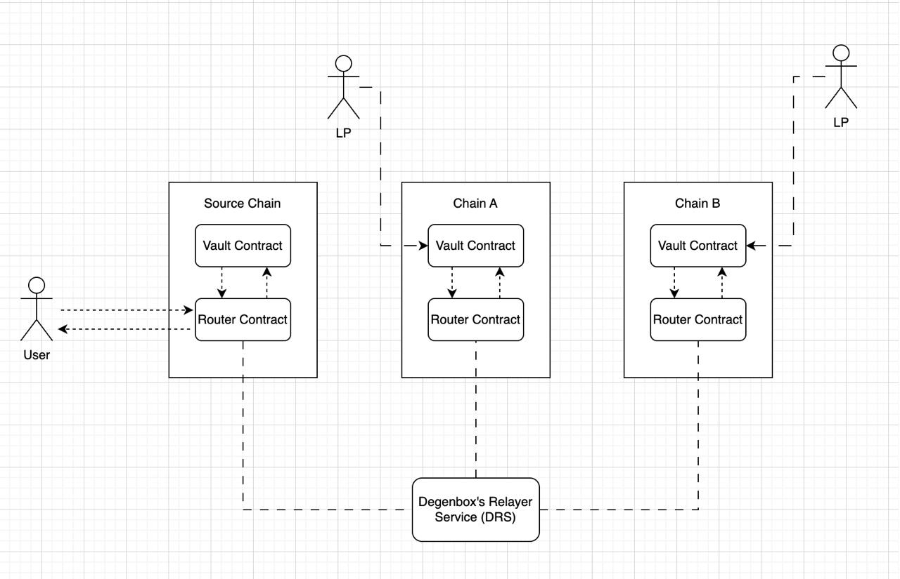
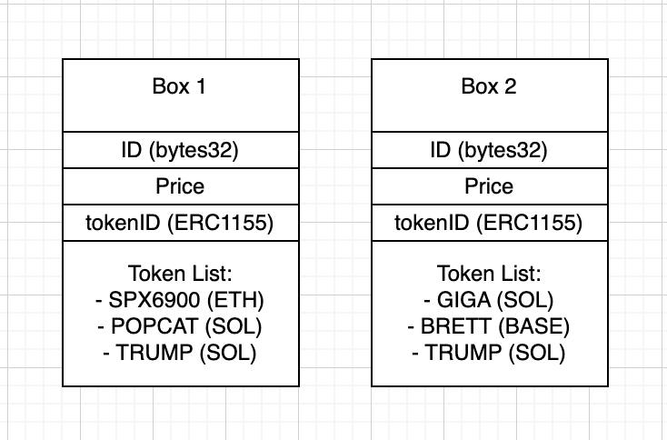

# Degenbox Technical Design

*Subject to change: This document is not final and may be adjusted based on the supported chains and implementation requirements.*

## Overview
Degen Box is a decentralized platform that combines the concept of mutual funds with the world of memecoins, offering users seamless exposure to various memecoins across multiple chains. This project aims to simplify the complexities of bridging funds across chains while providing a one-stop solution for buying into curated boxes of memecoins. The system leverages an ERC1155-based tokenization approach to represent ownership of these multi-chain token bundles.

## Solution
Degenbox introduces a bundled approach to meme token trading through its "Box" system, allowing users to:
- Purchase exposure to multiple meme tokens across different chains in a single transaction
- Manage their position through ERC1155 token
- Exit their position seamlessly across all included chains

## System Architecture

### Technical Design


### Core Components

1. **Box Definition**
   - Structure containing:
     - Box unique ID (bytes32)
     - Box price in USDC
     - ERC1155 token ID
     - Token list with chain specifications
     - Example format:
       ```
       Box {
           id: bytes32
           price: uint256
           tokenId: uint256
           tokens: [{
               symbol: string
               chain: string
               address: address
           }]
       }
       ```

2. **Smart Contracts**
   
   a. **Router Contract**
   - Entry point for user interactions
   - Trigger DRS (Degenbox's Relayer Service) to execute cross chain swaps
   - Handles ERC1155 minting/burning
   - Interfaces with Vault Contract
   - Key functions:
     - **Source chain:**
       - `buyBox(boxId)`
       - `sellBox(boxId)`
     - **Destination chain:**
       - `swap()`, can only be accessed by DRS
       - `addLiquidity(amount)`
       - `removeLiquidity(amount)`
       - `requestToRemoveLiquidity(amount)`
       - `claimLiquidity()`
      
   b. **Vault Contract** (can only be accessible through Router's contract)
   - Manages token custody
   - Locks/unlocks tokens 
   - Key functions:
     - `lock(boxId, _data)`
     - `unlock(boxId, _data)`
     - `swap(...)`
     - `addLiquditiy(amount)`
     - `removeLiquidity(amount)`

3. **Degenbox's Relayer Service (DRS)**  
   - Cross-chain orchestration system  
   - Monitors events across all supported chains  
   - Manages vault synchronization  
   - Executes optimized cross-chain token swaps with:  
     - Slippage managed based on the price at the time of initiation  
     - Optimal routing across multiple chains
     - Dynamic fee calculation, including:  
       - Network fees across chains  
       - Liquidity provider (LP) fees  
       - Protocol fees  

## Box Price Mechanics

### Box Example


### Price Calculation
1. **Initial Box Price**
   - Calculated based on predetermined token quantities
   - Example Box 1 composition:
     - 1,000,000 $SPX6900
     - 10,000,000 %POPCAT
     - 500,000 $TRUMP
   - Price = Σ(Token Quantity × Current Market Price)

2. **Price Updates**
   - Box prices are updated in real-time based on:
     - Market prices of constituent tokens
     - Network fees across chains
     - LP fees
     - Protocol fees

### Fee Structure
1. **Network Fees**
- Gas fees on across involved chains
- Swap fees on across involved chains

2. **Protocol Fees**
- 0.3% swap fee on each token
- Split between:
  - LP rewards (80%)
  - Protocol treasury (20%)

3. **Price Impact**
- Large purchases may experience price impact
- Maximum trade size limits to protect LP pools

## Liquidity Provider (LP) System

### Overview
The Degenbox system relies on liquidity providers (LPs) across different chains to facilitate cross-chain swaps. LPs play a crucial role in maintaining the system's efficiency and providing necessary token liquidity.

### LP Mechanics
1. **Liquidity Provision**
   - LPs deposit USDC into Vault Contracts on their respective chains
   - LPs receive LP tokens representing their share of the liquidity pool
   - Each chain maintains its independent LP pool

2. **Fee Distribution**
   - Swap fees are collected from every buy/sell operation that occurred on that chain
   - Fees are distributed proportionally to LPs based on their share
   - Fee collection occurs in real-time as swaps are executed

3. **LP Incentives**
   - Base swap fee: 0.3% of transaction volume
   - Fee distribution: 80% to LPs, 20% to protocol

## Transaction Flows

### Buy Flow
1. User initiates transaction with Router Contract on source chain
   - Can pay with any token that can be swapped to USDC
   - Router locks USDC into vault (will be act as liquidity)
   
2. DRS detects buy event
   - Monitors Router Contract events
   - Triggers parallel execution on source and destination chains
   - Performs token swaps on each chain per box specification with fee procedure
      - Uses liquidity from Users or LP pools to facilitate swaps efficiently
   - Locks acquired tokens in respective Vault Contracts
   - User receives ERC1155 token representing box ownership

### Sell Flow
1. User initiates sell with Router Contract on source chain
   - Burns the ERC1155 token through Router

2. DRS detects sell event
   - Monitors Router Contract events
   - Triggers parallel execution across destination chains
   - Executes token swaps back to USDC on respective chains with fee procedure
   - Triggers release of originally locked USDC to user on source chain

### Adding Liquidity Flow
1. User provides liquidity in USDC via Router Contract on the destination chain 
2. Vault Contract locks the USDC and issues LP tokens representing the user’s share
3. LPs earn a portion of swap fees generated on that chain

### Remove Liquidity Flow
1. User requests to remove liquidity via the Router Contract
2. If the requested amount is available in the Vault Contract:
   - User burns LP tokens
   - Receives the withdrawn USDC plus accrued fees

### Request To Remove Liquidity Flow
1. User requests liquidity removal via the Router Contract
2. If the requested amount is not available in the Vault Contract:
   - Protocol initiates a bridge process to transfer USDC from the source chain to the requested chain
   - Once liquidity is available, the user can proceed with through `claimLiquidity(..)` to get the liquidity back

## Security Considerations

1. **Vault Security**
   - Emergency pause functionality

2. **Relayer Security**
   - Fallback mechanisms for failed transactions on involved chains

3. **Price Impact Protection**
   - Reliable in extreme market conditions
   - Volume-based execution limits?

## Implementation Requirements

1. **Relayer System**
   - High-availability architecture (RPC, Relayer,)
   - Real-time monitoring
   - Automatic failover capabilities
   - Transaction receipt verification
